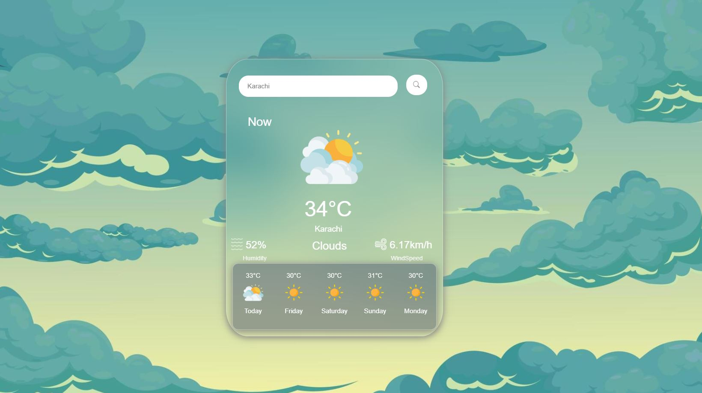
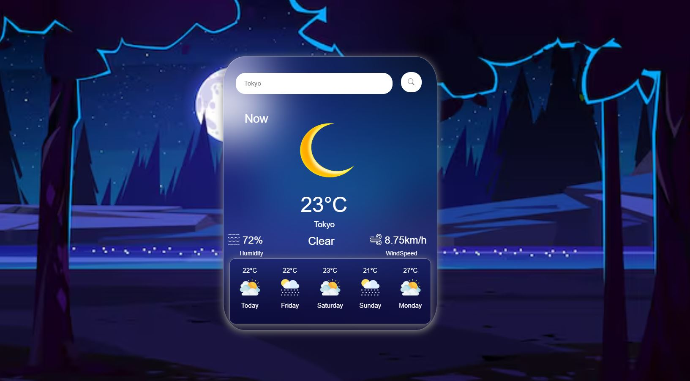
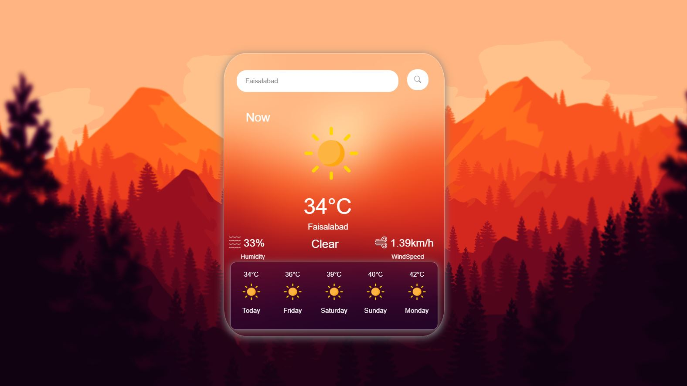

# Weather App 

A lightweight and responsive weather web application built with Vanilla JavaScript, HTML5, and CSS3. The app allows users to search for any city globally to fetch and display real-time weather metrics using the OpenWeatherMap API.

## Features

* **Real-Time Data:** Instant temperature, humidity, wind speed, and weather condition updates.
* **City Search:** Search functionality for locations worldwide.
* **Responsive UI:** Clean, modern layout optimized for both mobile and desktop screens.
* **Pure Vanilla Stack:** Built without external libraries or frontend frameworks.

## Tech Stack

* HTML5
* CSS3
* JavaScript (ES6+)
* OpenWeatherMap API

## Setup & Local Run

1. Clone or download this repository.
2. Create a `config.js` file in the root folder with your OpenWeather API key:
   ```javascript
   const CONFIG = {
     WEATHER_API_KEY: "YOUR_API_KEY_HERE"
   };
## App Preview




